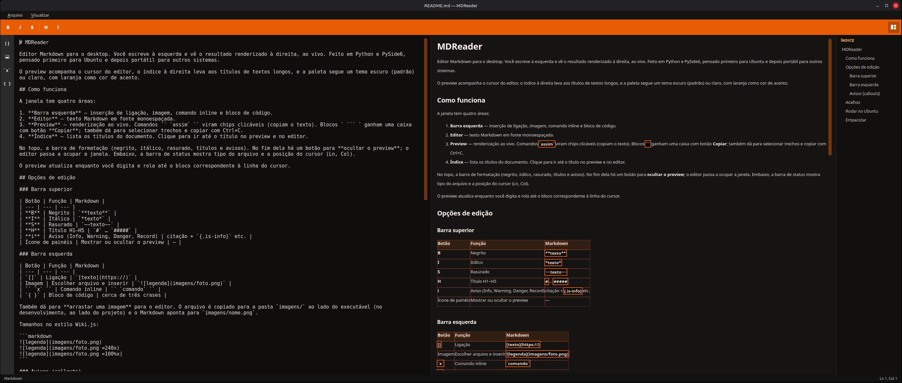

# MDReader

Editor Markdown para o desktop. Ao abrir um arquivo, a janela mostra o texto renderizado. O botão **Editar** divide a tela entre o texto e o resultado ao vivo. Feito em Python e PySide6, pensado primeiro para Ubuntu, mas o empacotamento é via PyInstaller.

> IMPORTANTE: Não é um editor de codigo, apenas um projeto que edita arquivos markdown, pra ajudar a fazer documentação.
{.is-warning}



O preview acompanha o cursor do editor, a barra de arquivos à esquerda lista os `.md` de uma pasta, o índice à direita leva aos títulos de textos longos, e a paleta segue um tema escuro (padrão) ou claro, com laranja como cor principal.

## Rodar no Ubuntu

```bash
sudo apt install python3 python3-venv python3-pip
./scripts/setup.sh
./scripts/run.sh
```

Com o ambiente já criado:

```bash
source .venv/bin/activate
python -m app
```

Se a janela Qt não abrir:

```bash
sudo apt install libxcb-cursor0 libxkbcommon-x11-0
```

## Empacotar

Executável local (PyInstaller):

```bash
./scripts/package.sh
```

O binário fica em um único arquivo, `dist/MDReader`. Ainda nao testei em Windows. Não é preciso reescrever o app.

## Como as imagens são salvas

Ao escolher uma imagem na barra esquerda ou arrastá-la para o editor, o MDReader **copia o arquivo** — não usa só o caminho original.

- A cópia vai para a pasta **`img/`** ao lado do executável. No desenvolvimento (`python -m app`), isso é a raiz do projeto.
- No Markdown entra um caminho relativo, por exemplo `img/foto.png`.
- Se o nome já existir, grava `foto-2.png`, `foto-3.png`, e assim por diante.
- A pasta é criada na primeira inserção. Com o app empacotado, `img/` fica ao lado de `dist/MDReader`.

Sintaxe no texto (tamanhos no estilo Wiki.js):

```markdown


```

## Como funciona

A janela tem cinco áreas:

1. **Arquivos** — barra lateral esquerda (após **Arquivo → Abrir pasta…**). Lista pastas e arquivos `.md`; clique para abrir.
2. **Leitura** — ao abrir um arquivo, ou ao escolhê-lo na pasta, a janela mostra só a renderização e o botão **Editar**.
3. **Barra de inserção** — aparece no modo de edição: ligação, imagem, comando inline, bloco de código e recarregar o arquivo **(R)**.
4. **Editor** — texto Markdown em fonte monoespaçada, ao lado do preview, depois de clicar em **Editar**.
5. **Preview** — renderização ao vivo. Comandos `` `assim` `` viram chips clicáveis (copiam o texto). Blocos ` ``` ` ganham uma caixa com botão **Copiar** e o nome da linguagem (`bash`, `python`, `html`, `http`, `nodejs`, `typescript`, `go`). Diagramas `mermaid`, `flowchart`, `erDiagram` e `sequenceDiagram` são desenhados. Também dá para selecionar trechos e copiar com Ctrl+C.
6. **Índice** — lista os títulos do documento. Clique para ir até o título no preview e no editor.

No modo de edição, a barra de formatação (negrito, itálico, rasurado, títulos e avisos) fica no topo. No fim dela há um botão para **ocultar o preview**; o editor passa a ocupar a janela. Embaixo, a barra de status mostra tipo do arquivo e a posição do cursor (Ln, Col).

O preview atualiza enquanto você digita e rola até o bloco correspondente à linha do cursor. Um arquivo novo (Ctrl+N) já abre dividido, pronto para escrever.

## Opções de edição

### Barra superior

| Botão | Função | Markdown |
| --- | --- | --- |
| **B** | Negrito | `**texto**` |
| **I** | Itálico | `*texto*` |
| **S** | Rasurado | `~~texto~~` |
| **H** | Título H1–H5 | `#` … `#####` |
| **i** | Aviso (Info, Warning, Danger, Record) | citação + `{.is-info}` etc. |
| Ícone de painéis | Mostrar ou ocultar o preview | — |

### Barra esquerda

| Botão | Função | Markdown |
| --- | --- | --- |
| `[]` | Ligação | `[texto](https://)` |
| Imagem | Escolher arquivo e inserir | `` |
| `` `x` `` | Comando inline | `` `comando` `` |
| `{ }` | Bloco de código | cerca de três crases |
| **(R)** | Recarregar o arquivo do disco | — |

No fim da barra, o **(R)** (parênteses brancos, R laranja) relê o `.md` que está aberto. Serve quando outra pessoa ou outro editor altera o mesmo arquivo.

O app **detecta mudanças no disco** e avisa na barra de status. Se você tiver alterações locais e clicar em **(R)**, aparece um aviso: recarregar **descarta** o que ainda não foi salvo. Sem arquivo aberto no disco, o botão não tem o que recarregar.

### Avisos (callouts)

Use uma citação, uma linha em branco e o marcador. A linha `{.is-*}` some no preview e o bloco ganha cor.

```markdown
> Informação útil para o leitor.

{.is-info}
```

Os tipos são `{.is-info}`, `{.is-warning}`, `{.is-danger}` e `{.is-record}`.

## Atalhos

| Atalho | Ação |
| --- | --- |
| **Ctrl+N** | Novo arquivo |
| **Ctrl+O** | Abrir arquivo |
| **Ctrl+Shift+O** | Abrir pasta |
| **Ctrl+S** | Salvar |
| **Ctrl+Shift+S** | Salvar como |
| **Ctrl+B** | Negrito |
| **Ctrl+I** | Itálico |
| **Ctrl+Q** | Sair |


---

Menus **Arquivo** (inclui Fechar pasta) e **Visualizar** (tema escuro / tema claro) cobrem o restante. O app abre no tema escuro.


## Proposta

A ideia é ter um editor especifico de arquivos markdown vendo o resultado em tempo real. Claro que os formatos do texto final depende do app que esta rodando. Aqui eu criei o design que eu gostei mais, mas ao rodar no github por exemplo, o design vai ser formato github. Ainda sim, todas as ferramentas basicas como tabelas, blocos de informação e titulos são o padrão do markdown, o que faz com que o texto seja gerado em qualquer app que aceite o formato md. Eu Prefiro fazer minha documentação em markdown, como voicê pode ver no projeto com o `docdir.md`, checando sempre o estado atual do projeto.